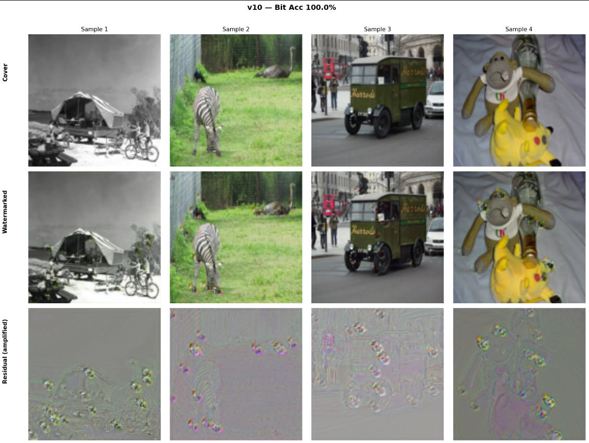

# Secure Image Watermarking Using Deep Learning

An end-to-end, HiDDeN-inspired deep learning pipeline that embeds a **30-bit invisible watermark** into images and recovers it reliably even after common distortions (JPEG, noise, blur, crop, rotation, scaling). Built with PyTorch and trained on a Kaggle T4 GPU.

> 📄 Full write-up: [`report/Image_Watermarking_Report.pdf`](report/Image_Watermarking_Report.pdf)

## Results

Evaluated on the 1,000 held-out validation images (clean channel, no attack):

| Metric | Result |
|---|---|
| Bit accuracy | **99.97%** (BER 0.03%) |
| PSNR | **30.89 dB** |
| SSIM | **0.9462** |

Best validation bit accuracy during training (with noise active): **99.99%**.

### Robustness (BER after attack, validation set)

| Attack | BER | Bit accuracy |
|---|---|---|
| Gaussian noise (σ = 0.05) | 0.06% | 99.94% |
| Dropout (25%) | 0.15% | 99.85% |
| Blur (5×5, σ = 1.0) | 0.99% | 99.01% |
| JPEG (Q = 50, simulated) | 0.18% | 99.82% |
| Crop (85%) | 0.27% | 99.73% |
| Rotation (±10°) | 0.10% | 99.90% |
| Scale (0.9–1.1×) | 0.03% | 99.97% |
| *Combined:* noise + blur | 1.15% | 98.85% |
| *Combined:* JPEG + crop | 1.06% | 98.94% |
| *Combined:* noise + dropout | 0.32% | 99.68% |





## How it works

Three components are trained jointly, plus a discriminator:

1. **Encoder**: Extracts features from the cover image (ResBlock + CBAM attention), tiles the 30-bit message into 30 spatial planes and concatenates it with the features, then re-concatenates the original cover (cover-skip) before a final conv + Tanh. Output is a watermarked image in `[-1, 1]`.
2. **Noise layer**: A differentiable attack layer between encoder and decoder. One attack is picked at random per batch: Gaussian noise, dropout, blur, simulated JPEG (straight-through estimator), crop, rotation, or scale.
3. **Decoder**: Strided/pooled conv blocks, Global Average Pooling, then a single linear head that outputs 30 logits (one per bit).
4. **Discriminator**: Lightweight GAN-style critic (cover vs watermarked) that pushes the watermark toward imperceptibility.

**Loss:** `λ_msg · BCE(decoded, message) + λ_img · MSE(cover, watermarked) + λ_adv · BCE(D(watermarked), 1)`

| Setting | Value |
|---|---|
| Image size | 128 × 128 |
| Message length | 30 bits (fresh random message per sample, every epoch) |
| Loss weights | λ_msg = 1.0, λ_img = 0.7, λ_adv = 0.001 |
| Optimizer | Adam(W), lr = 1e-3, constant, no weight decay |
| Epochs | 200, noise active from epoch 1 |
| Batch size | 64 |
| Mixed precision | Yes (AMP) |

**Parameters:** Encoder 394,345 · Decoder 1,154,014 · Discriminator 75,905 · **Total 1,624,264 (≈1.6M)**

## Dataset

[COCO 2017](https://www.kaggle.com/datasets/awsaf49/coco-2017-dataset) `train2017`. A random sample of 10,000 images (seed 42) is resized to 128×128, cached as a single tensor file, and split 90/10 into train/validation. The dataset is **not** included in this repo.

## Repository structure

```
.
├── Image_watermarking.ipynb      # Full pipeline: data, model, training, evaluation, demo
├── checkpoints/
│   └── resume_ckpt.pth           # Final checkpoint (epoch 200, best val bit-acc 99.99%)
├── report/
│   └── Image_Watermarking_Report.pdf
├── requirements.txt
└── README.md
```

## Getting started

```bash
git clone https://github.com/<your-username>/<your-repo>.git
cd <your-repo>
pip install -r requirements.txt
```

### Run on Kaggle (original setup)
1. Upload the notebook to Kaggle and enable a **GPU T4** accelerator.
2. Add the `awsaf49/coco-2017-dataset` dataset via *+ Add Data*.
3. Run all cells.

### Run locally
Edit the paths in the **Global Configuration** cell:
```python
COCO_DIR       = "path/to/coco2017/train2017"
CACHE_FILE     = "coco_20k_128.pt"          # (cell in Section 2; actual size is 10,000 images)
CHECKPOINT_DIR = "./checkpoints"
```

### Use the pretrained checkpoint
`checkpoints/resume_ckpt.pth` is the checkpoint after **epoch 200**, which also has the best validation bit accuracy (**99.99%**). It contains the encoder, decoder, discriminator, both optimizers, AMP scalers, epoch, best accuracy, and training history (checkpoints were saved every 25 epochs and training was resumed across Kaggle sessions).

To resume training or run evaluation, point `RESUME_CKPT` in the notebook at it:

```python
RESUME_CKPT = "./checkpoints/resume_ckpt.pth"
```

To load the weights only for inference:

```python
ckpt = torch.load("checkpoints/resume_ckpt.pth", map_location=DEVICE, weights_only=False)
encoder.load_state_dict(ckpt["encoder"])
decoder.load_state_dict(ckpt["decoder"])
encoder.eval(); decoder.eval()
```

## Notebook contents

0. Install and imports
1. Global configuration
2. Dataset, tensor cache, GPU augmentation
3. Encoder (ResBlock + CBAM + cover-skip) and decoder
4. Differentiable noise layer
5. Loss functions
6. Training loop (two optimizers, AMP, checkpointing)
7. Training curves
8. Evaluation: bit accuracy, PSNR, SSIM
9. Per-attack BER breakdown
10. Visual comparison: cover vs watermarked vs residual
11. Single-image inference demo
12. Step-by-step walkthrough of encoder/decoder internals and an attack robustness sweep

## Tech stack

PyTorch · torchvision · Kornia · scikit-image · NumPy · Matplotlib

## References

- Zhu et al., *HiDDeN: Hiding Data With Deep Networks*, ECCV 2018.
- Woo et al., *CBAM: Convolutional Block Attention Module*, ECCV 2018.


## Authors

- Barath Dharshan
- Mohamed Amjad
- Syed Farhan Syed Sathik Basha
